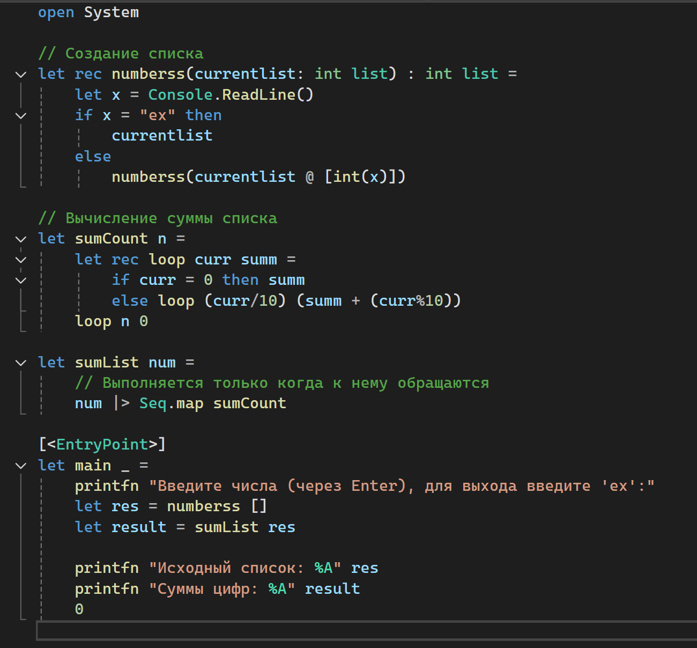
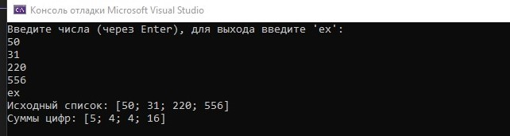
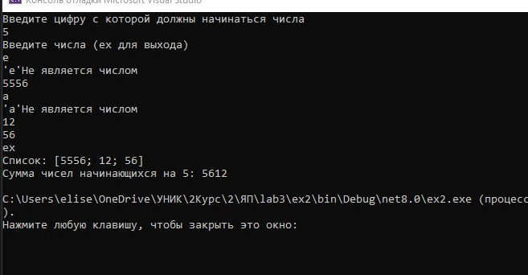
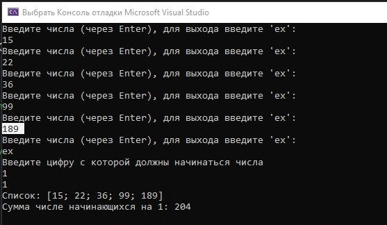

# Мартелов Елисей Группа ИТС1 Лабораторная №3

## Задание 1

### Задача 1

### Текст задачи

#### Получить список из сумм цифр натуральных чисел, содержащихся в исходном списке испольузя Seq.map

### Алгоритм решения

###### 

#### В функции numberss вводятся числа. После чего в sumList проход по каждому элементу(в отличие от List.map, который работает только со списками, Seq.map может работать с чем угодно: массивы, списки, сторки, строчки в .txt файле)
#### В sumCount считается сумма цифр числа. После чего идёт вывод в строку

### Тестирование

##### 

## Задание 2

### Задача 1

### Текст задачи

#### Найти сумму тех элементов списка, которые начинаются на заданную цифру испольузя Seq.fold

### Алгоритм решения

###### 

#### Ввод списка. Ввод цифры с которой должены начинаться числа. Получение первой цифры "search" с помощью преобразования в строку и поиск по .[0] индексу.
#### В "sum" происходит сравнение "x" - первый элемент списка, с введённой цифрой "target" - цифра с которой должны начинаться числа.
#### Вывод " printfn "Сумма числе начинающихся на %d: %d" target res"

#### Отличие List.fold от Seq.fold в том что, List - работает только со списками, Seq - работает со всем что поддерживает интерфейс IEnumerable(массив, список, множ, строки). Seq.fold не загружает всё в памать, а работает по одному элементу. List.fold все элементы должны лежать в памяти.

### Тестирование

##### 

