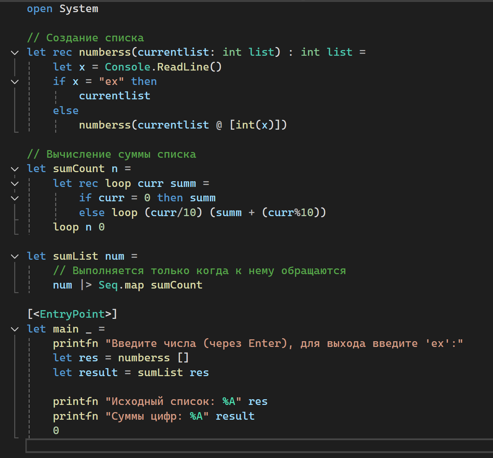
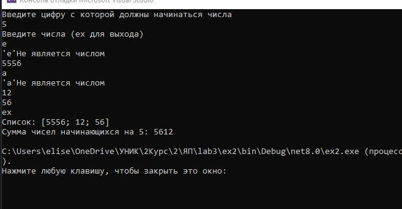
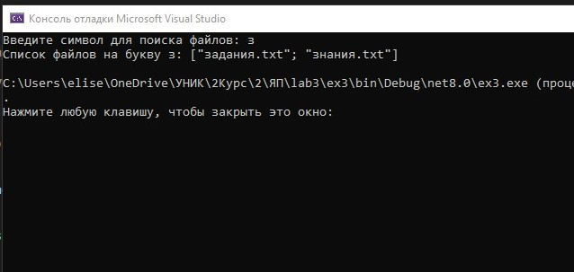

# Мартелов Елисей Группа ИТС1 Лабораторная №3

## Задание 1

### Задача 1

### Текст задачи

#### Получить список из сумм цифр натуральных чисел, содержащихся в исходном списке используя Seq.map

### Алгоритм решения

###### 

#### В функции input:
##### 1) Создаётся генератор ленивой последовательности (Seq.initInfinite)(генератору не нужен входящий элемент - _), она не считает всё сразу а ждёт пока попросят следующий элемент, и только тогда берёт элемент из консоли(Console.ReadLine).
##### 2) Условие для выхода (Seq.takeWhile - функция проверяет каждую введённую строку и пока условие x <> "ex" не будет введенно бесконечный генератор не остановиться.
##### 3) Фильтр с трансформацией (Seq.choose) - если пользователь ввёл не число, то TryParse выдаст false и вернёт в None в Seq.choose. После чего выбросит этот элемент из последовательности и заставит Seq.initInfinite считать следующую строку с консоли.
##### 4) Seq.map - берёт функцию sumCount и применяет её к каждому элементу последовательности, создавая на выходе новую последовательность с результатами.

#### Ленивая последовательность Seq работает в таком порядке: 1)Seq.iter требует элемент у 2)Seq.map(при этом map должен посчитать сумму), он в свою очередь требует элемент у 3)Seq.choose которая запрашивает у 4)Seq.takeWhile строку (takeWhile проверяет условие выхода), которая в свою очередь запрашивает у 5) Seq.initInfinite строку, а она уже вызывает Console.ReadLine и пользователь вводит число. И это число летит обратно вверх по цепочке. Только после это Seq.iter просит следующий элемент.

### Тестирование

## Задание 2

### Задача 1

### Текст задачи

#### Найти сумму тех элементов списка, которые начинаются на заданную цифру испольузя Seq.fold

### Алгоритм решения

###### 

#### В main: происходит запрос цифры с которой должны начинаться числа для суммы(target), далее в input происходит запрос чисел, проверка на завершение(Seq.takeWhile), Seq.choose - используется для проверки на ввод чисел, а не букв.
#### В Seq.fold в input - происходит проверка первого символа введённого числа(search) и в случает удачи складывает те числа, что начинаются на target

#### Отличие List.fold от Seq.fold в том что, List - работает только со списками и нагржает память, Seq - работает со всем что поддерживает интерфейс IEnumerable(массив, список, множ, строки) и не грузит память тк значения пролетают без сохранения, но с ними можно работать в момент пролёта.

### Тестирование

## Задание 3

### Задача 1

### Текст задачи

#### Вывести список файлов, имя которых начинается с заданного символа, в указанном каталоге.

### Алгоритм решения

###### 

#### В функции "symbol" вводится первая буква для поиска файлов. В main происходит проверка существования папки (Directory.Exists(path)). В Directory.EnumerateFiles(path) - происходит получение полседовательностей путей. В ней уже преобразует большой путь в коротке имя(Seq.map Path.GetFileName), ищет файлы на введённую букву(|> Seq.filter (fun name -> name.[0] = s.[0])), проебразует в список. В конце программы вывод

### Тестирование

